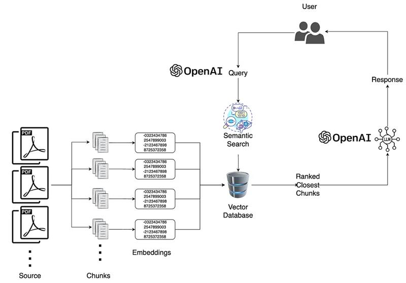

# Cortex Waves Chatbot with Retrieval-Augmented Generation (RAG) Using FAISS, LangChain, and Streamlit

### Architecture


### Key Libraries and Technologies

- **FAISS**: Facebook’s AI Similarity Search (FAISS) is a library designed for efficient similarity search and clustering of dense vectors, which is perfect for large-scale search tasks.
- **LangChain**: An open-source library for building language model-driven applications, LangChain simplifies the handling of embeddings, chains, and interactions with language models.
- **Streamlit**: An open-source Python library that lets you build interactive web applications quickly.
- **PyPDF2**: A Python library for extracting text from PDF files.

```
Process
PDF Source -> Chunks -> Embeddings(openAI) -> Vector Store(faiss/vectordb/pinedb) -> ranked results
